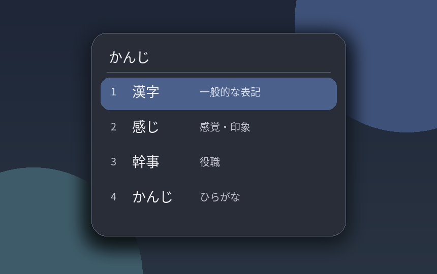

# Caelestia Mozc candidate theme

A Caelestia inspired theme for the **Fcitx5 Classic UI** candidate popup. Mozc remains the conversion engine; Fcitx5 continues to handle placement, focus, selection, and paging. The theme generator reads only the colour fields in Caelestia's generated scheme and creates a translucent, rounded PNG surface with a small shadow. It does not read wallpapers, dictionaries, or input history.

This directory is the Fcitx5 theme component inside the parent dotfiles repository's `arch/caelestia` Stow package. It keeps the generator, documentation, and tests together; Stow links only the command and optional user service. The generated theme and private install backup remain outside Git. Run `scripts/stow-arch` from the dotfiles root to preview the package links before applying them. The generator can also be run directly with `python3 theme.py` without Stow. The `LICENSE` in this directory covers this component; it does not change the licensing of other dotfiles.



## Requirements

- Linux with Fcitx5 Classic UI (tested against the 5.1.22 theme format). Mozc is optional for other Fcitx5 engines.
- Python 3 and [Pillow](https://python-pillow.org/) for PNG generation. On Arch Linux, install `python-pillow` through your package manager if needed.
- Caelestia Shell/CLI for wallpaper and mode colour sync. Without its scheme file, the generator uses a built in dark or light palette.
- A Wayland compositor supporting Fcitx5 input popups. Background blur additionally requires a compatible compositor protocol and compositor blur settings. Transparency and the image shadow still work without blur.

No Qt/QML runtime is added by this project. No Caelestia or Hyprland file is modified.

## Preview safely

From this project directory, run:

```sh
python3 theme.py render --scheme examples/scheme.example.json --output generated/example
```

This writes only to `generated/example`. To see your current Caelestia colours in an isolated directory, omit `--scheme`. The default source is `${XDG_STATE_HOME:-$HOME/.local/state}/caelestia/scheme.json`. If it is unavailable or invalid, `--fallback-mode light` or `--fallback-mode dark` selects a readable fallback.

## Install

Review the exact changes below before running `install`:

1. Create `${XDG_DATA_HOME:-$HOME/.local/share}/fcitx5/themes/caelestia-mozc/` with generated PNGs and `theme.conf`. An existing directory or symlink at that location causes installation to stop.
2. Save the original Classic UI config bytes in `${XDG_STATE_HOME:-$HOME/.local/state}/caelestia-fcitx5-theme/classicui.conf.before-install` with private permissions. A private install record is stored beside it.
3. Set only `Theme=caelestia-mozc` and `DarkTheme=caelestia-mozc` in `${XDG_CONFIG_HOME:-$HOME/.config}/fcitx5/conf/classicui.conf`. Other settings, Mozc data, and key bindings are left alone.

```sh
python3 theme.py install
```

The installer does not restart or reload Fcitx5. When you are ready, apply the new theme with `fcitx5-remote -r` or through the Fcitx5 configuration UI. If the config file was absent, the installer creates it. If any installation destination already exists, it stops without overwriting it.

This theme applies when Fcitx5 is using Classic UI. If a different UI frontend such as Kimpanel is active, switch that frontend through your Fcitx5 configuration before expecting the appearance to change; this installer does not change the active UI frontend.

To follow wallpaper and light/dark scheme changes, run the watcher while your session is active:

```sh
python3 theme.py watch
```

The watcher checks the scheme file every two seconds and regenerates only after it changes. It then asks Fcitx5 to reload its configuration with `fcitx5-remote -r`; it does not restart the service. It can be started from a user session launcher or a user service if you want it to run automatically. Keep the project directory in place while using the watcher. If Caelestia is absent, the fallback palette remains usable.

For a temporary user service that lasts until logout, you can run this from the project directory:

```sh
systemd-run --user --unit=caelestia-fcitx5-theme --collect --property=Restart=on-failure --property=WorkingDirectory="$PWD" /usr/bin/python3 theme.py watch
```

It creates no persistent unit file. Stop it with `systemctl --user stop caelestia-fcitx5-theme.service`. For automatic startup on later logins, add the watcher to your own session startup configuration after reviewing that change.

In the parent dotfiles repository, the Stow package includes a persistent user unit. After `scripts/stow-arch --apply` and theme installation, use `systemctl --user daemon-reload` followed by `systemctl --user enable --now caelestia-fcitx5-theme.service`. If a temporary unit with that name is running, stop it first. Disable with `systemctl --user disable --now caelestia-fcitx5-theme.service` before uninstalling the theme. Stow does not enable the unit automatically.

## Uninstall and rollback

Stop the watcher (`Ctrl+C` in its terminal, or the `systemctl --user stop` command above if started as a temporary service), then run:

```sh
python3 theme.py uninstall
fcitx5-remote -r
```

Uninstall restores the two previous theme choices, preserves other later config edits, removes only its own theme directory, and deletes its private backup and install record. If you changed either theme choice after installation, uninstall stops rather than replacing that change. The saved `classicui.conf.before-install` is available for manual recovery. For immediate manual rollback, select your previous Classic UI theme in `fcitx5-configtool` and reload Fcitx5.

## Adjusting the design

See [DESIGN.md](docs/DESIGN.md) for colour mapping, PNG dimensions, margins, alpha, blur, font, and DPI choices, and [RESEARCH.md](docs/RESEARCH.md) for the environment inspection and technical choice. All editable design values live in `theme.py`. The Classic UI font is intentionally left as your existing setting; `Noto Sans CJK JP 11` is a good optional choice on systems with that font installed. Set it through the Fcitx5 Classic UI configuration panel if desired.

## Limits and verification

The theme can request blur through Fcitx5, but only the compositor can actually blur pixels behind the input popup. The PNG shadow is an image effect, not a compositor shadow. Fcitx5 Classic UI controls popup placement and focus; this project changes appearance only. A live candidate popup must be checked on each target compositor and scale. The current verification record is in [TESTING.md](docs/TESTING.md).

The project contains original code and generated art only. It does not bundle Caelestia, Fcitx5, Mozc, fonts, or third party theme assets. The illustrative preview was rendered with Noto Sans CJK glyphs; the font file is not distributed (the installed font package reports OFL-1.1). Relevant upstream references: [Fcitx5 theme guide](https://fcitx-im.org/wiki/Fcitx_5_Theme), [Fcitx5 Wayland guide](https://fcitx-im.org/wiki/Using_Fcitx_5_on_Wayland/en), [Fcitx5 5.1.22 theme fields](https://github.com/fcitx/fcitx5/blob/5.1.22/src/ui/classic/theme.h), and [Caelestia Shell](https://github.com/caelestia-dots/shell).

Caelestia Shell and CLI are GPL-3.0 projects, but this repository does not copy or link their code or assets. It reads generated palette values as input data and uses original code and art to produce a separate Fcitx5 theme. The [GNU GPL FAQ on program output](https://www.gnu.org/licenses/gpl-faq.html#WhatCaseIsOutputGPL) explains why a program's GPL does not generally apply to its output; the [GNU license list](https://www.gnu.org/licenses/license-list.html#Expat) identifies the MIT/Expat license as GPL compatible. If Caelestia code or assets are incorporated in a future version, review those additions and their license obligations separately.

## Before publishing

Review every new or changed file and image in the parent dotfiles repository manually. In particular, inspect staged files with `git diff --cached --name-only` and `git diff --cached`, then run the project scan in [TESTING.md](docs/TESTING.md). Confirm that no local configuration, real screenshot, personal path, email, host name, token, private key, Mozc dictionary, learning data, or input history was added. Automated scans reduce risk but cannot prove absence of private data. The parent repository's remote and publication policy govern pushes.
